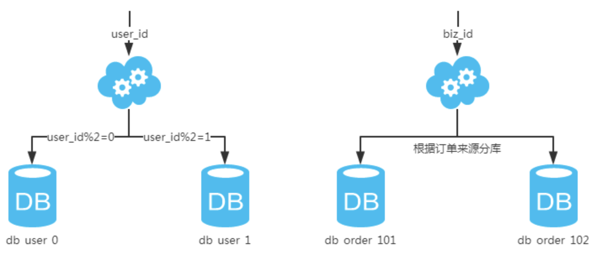
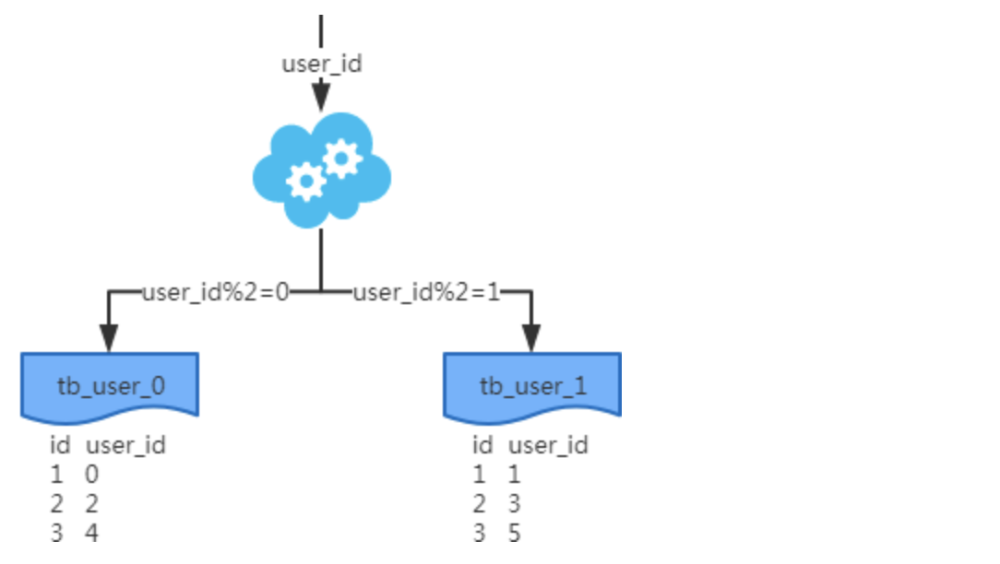
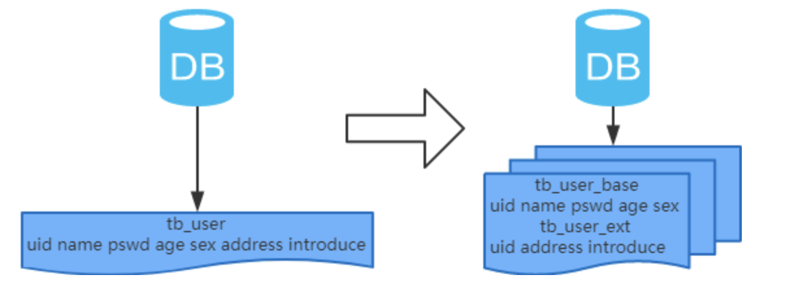
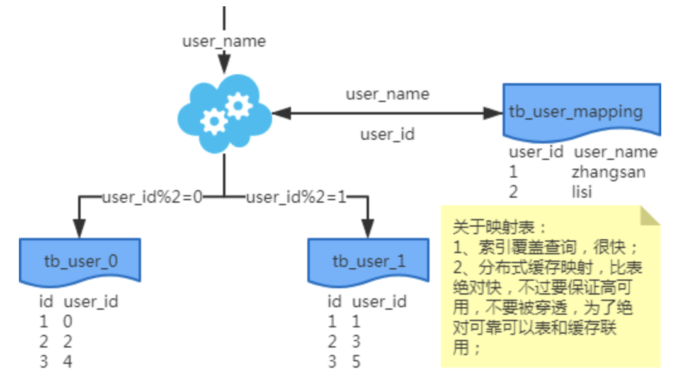
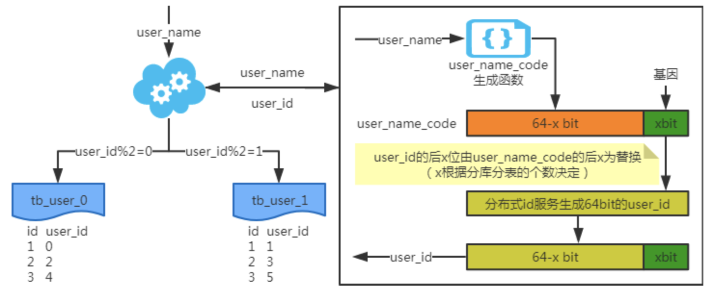
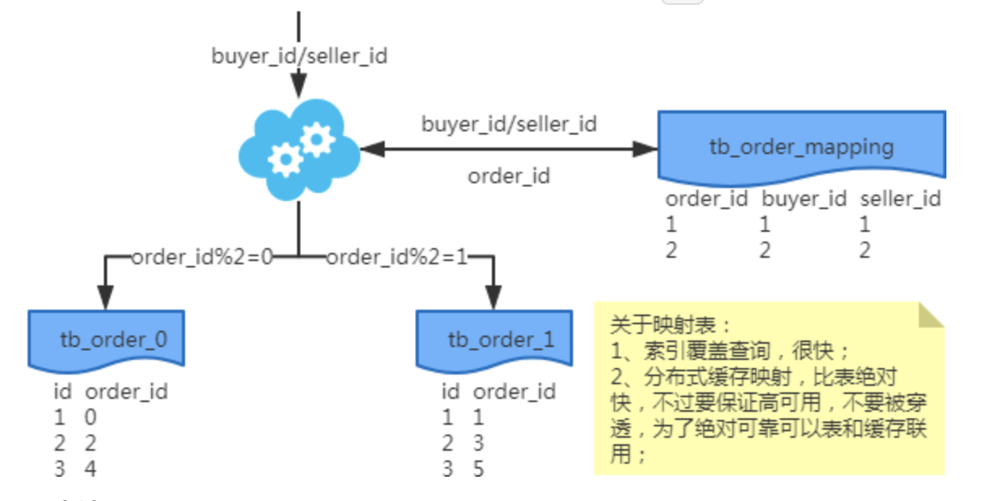
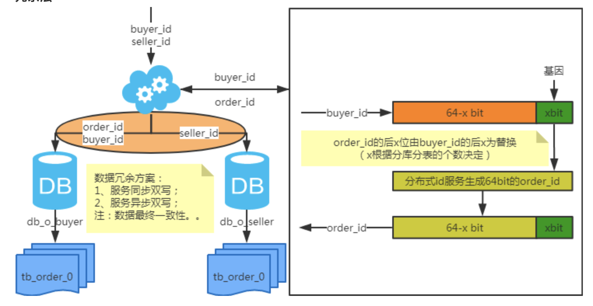
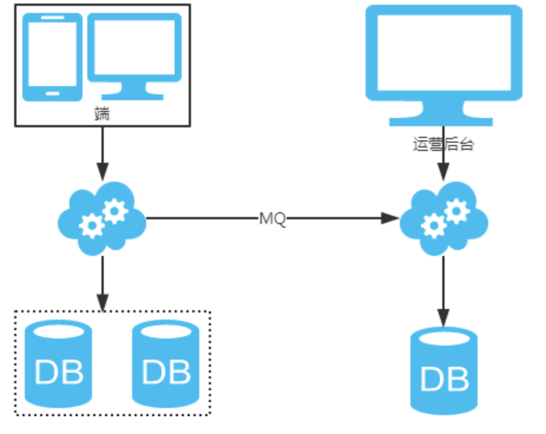
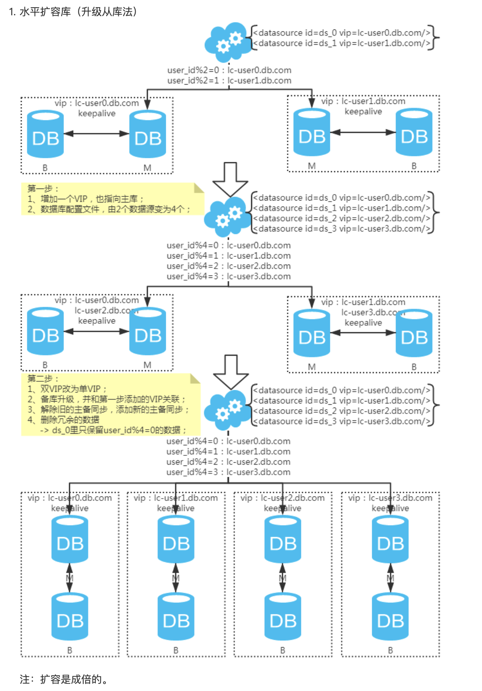
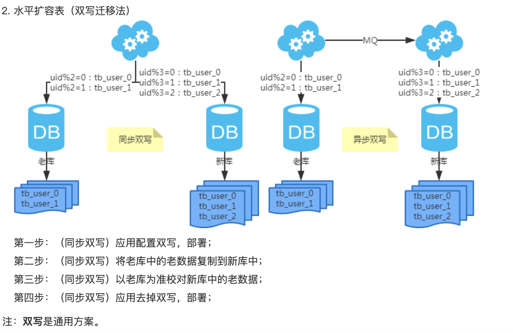

# 分库分表

## 1. 水平分库

**概念：**以字段为依据，按照一定策略（hash、range等），将一个库中的数据拆分到多个库中。

**结果：**

* 每个库的结构都一样；
* 每个库的数据都不一样，没有交集；
* 所有库的并集是全量数据；

**场景：**系统绝对并发量上来了，分表难以根本上解决问题，并且还没有明显的业务归属来垂直分库。

**分析：**库多了，io和cpu的压力自然可以成倍缓解。

## 2. 水平分表

**概念：**以字段为依据，按照一定策略（hash、range等），将一个表中的数据拆分到多个表中。

**结果：**

* 每个表的结构都一样；
* 每个表的数据都不一样，没有交集；
* 所有表的并集是全量数据；

**场景：**系统绝对并发量并没有上来，只是单表的数据量太多，影响了SQL效率，加重了CPU负担，以至于成为瓶颈。

**分析：**表的数据量少了，单次SQL执行效率高，自然减轻了CPU的负担。

## 3. 垂直分库

**概念：**以表为依据，按照业务归属不同，将不同的表拆分到不同的库中。

**结果：**

* 每个库的结构都不一样；
* 每个库的数据也不一样，没有交集；
* 所有库的并集是全量数据；

**场景：**系统绝对并发量上来了，并且可以抽象出单独的业务模块。

**分析：**到这一步，基本上就可以服务化了。例如，随着业务的发展一些公用的配置表、字典表等越来越多，这时可以将这些表拆到单独的库中，甚至可以服务化。再有，随着业务的发展孵化出了一套业务模式，这时可以将相关的表拆到单独的库中，甚至可以服务化。

## 4. 垂直分表

**概念：**以字段为依据，按照字段的活跃性，将表中字段拆到不同的表（主表和扩展表）中。

**结果：**

* 每个表的结构都不一样；
* 每个表的数据也不一样，一般来说，每个表的字段至少有一列交集，一般是主键，用于关联数据；
* 所有表的并集是全量数据；

**场景：**系统绝对并发量并没有上来，表的记录并不多，但是字段多，并且热点数据和非热点数据在一起，单行数据所需的存储空间较大。以至于数据库缓存的数据行减少，查询时会去读磁盘数据产生大量的随机读IO，产生IO瓶颈。

**分析：**可以用列表页和详情页来帮助理解。垂直分表的拆分原则是将热点数据（可能会冗余经常一起查询的数据）放在一起作为主表，非热点数据放在一起作为扩展表。这样更多的热点数据就能被缓存下来，进而减少了随机读IO。拆了之后，要想获得全部数据就需要关联两个表来取数据。但记住，千万别用join，因为join不仅会增加CPU负担并且会讲两个表耦合在一起（必须在一个数据库实例上）。关联数据，应该在业务Service层做文章，分别获取主表和扩展表数据然后用关联字段关联得到全部数据。

## 5. 分库分表问题

### 5.1 非partition key的查询问题（水平分库分表，拆分策略为常用的hash法）

#### 5.1.1 端上除了partition key只有一个非partition key作为条件查询

- 映射法 ------------

- 基因法 -------------

> 写入时，基因法生成user_id，如图。关于xbit基因，例如要分8张表，23=8，故x取3，即3bit基因。根据user_id查询时可直接取模路由到对应的分库或分表。根据user_name查询时，先通过user_name_code生成函数生成user_name_code再对其取模路由到对应的分库或分表。id生成常用snowflake算法。

#### 5.1.2 端上除了partition key不止一个非partition key作为条件查询

- 映射法 --------------

- 冗余法 -----------

> 按照order_id或buyer_id查询时路由到db_o_buyer库中，按照seller_id查询时路由到db_o_seller库中。感觉有点本末倒置！有其他好的办法吗？改变技术栈呢？

#### 5.1.3 后台除了partition key还有各种非partition key组合条件查询

- NOSQL法 -----------------

- 冗余法 ------------------

### 5.2 非partition key跨库跨表分页查询问题（水平分库分表，拆分策略为常用的hash法）

NOSQL法(ES等)

### 5.3 扩容问题（水平分库分表，拆分策略为常用的hash法）

## 6. 分库分表总结

分库分表，首先得知道瓶颈在哪里，然后才能合理地拆分（分库还是分表？水平还是垂直？分几个？）。且不可为了分库分表而拆分。

选key很重要，既要考虑到拆分均匀，也要考虑到非partition key的查询。

只要能满足需求，拆分规则越简单越好。

