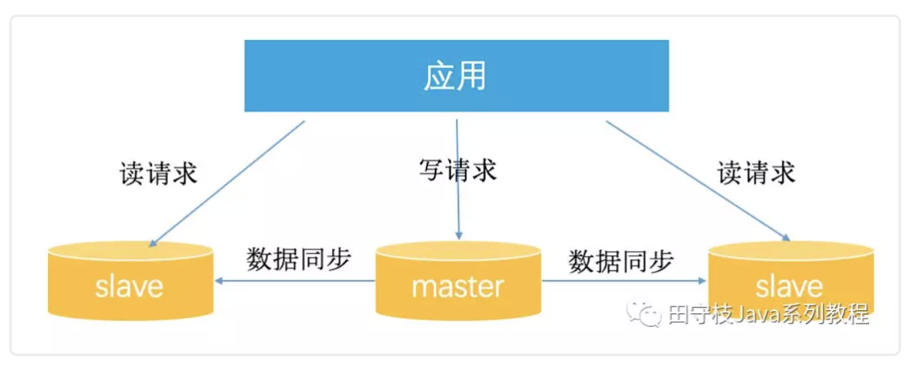
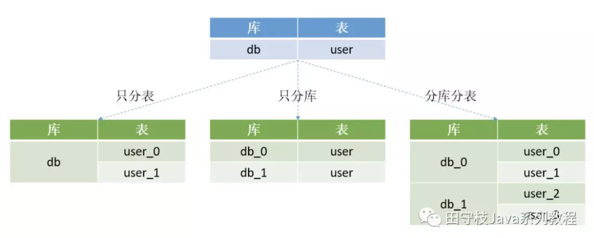
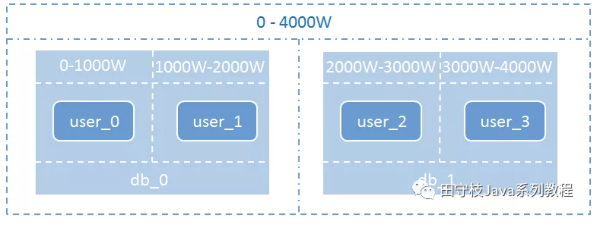
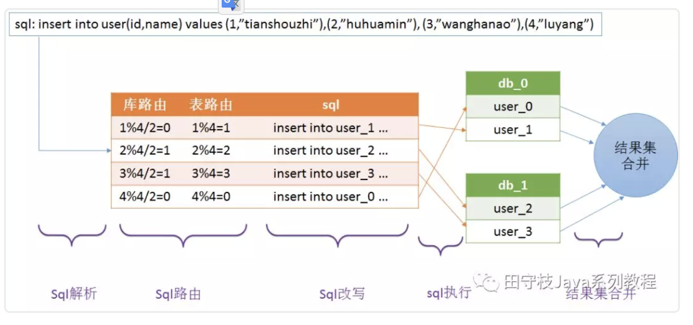
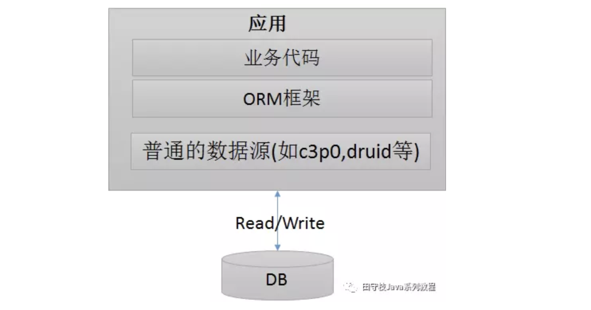
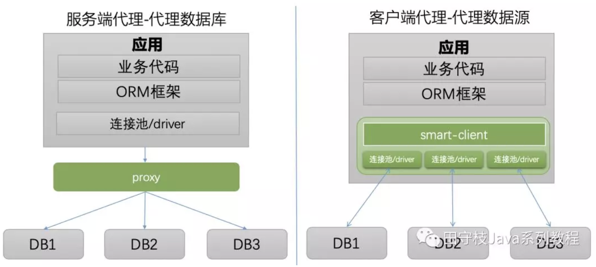
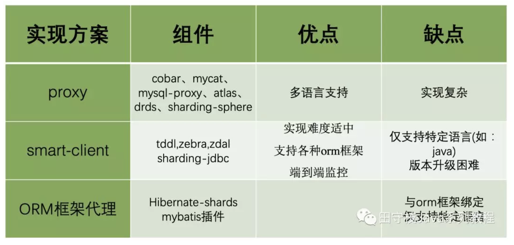

# 数据库中间件详解 | 珍藏版

## 1. 数据库拆分过程及挑战

互联网当下的数据库拆分过程基本遵循的顺序是：**垂直拆分**、**读写分离**、**分库分表(水平拆分)**。每个拆分过程都能解决业务上的一些问题，但同时也面临了一些挑战。 

### 1.1 垂直拆分

对于一个刚上线的互联网项目来说，由于前期活跃用户数量并不多，并发量也相对较小，所以此时企业一般都会选择将所有数据存放在一个数据库 中进行访问操作。举例来说，对于一个电商系统，其用户模块和产品模块的表刚开始都是位于一个库中。


其中：user、useraccount表属于用户模块，productcategory、product表属于产品模块

刚开始，可能公司的技术团队规模比较小，所有的数据都位于一个库中。随着公司业务的发展，技术团队人员也得到了扩张，划分为不同的技术小组，不同的小组负责不同的业务模块。例如A小组负责用户模块，B小组负责产品模块。此时数据库也迎来了第一次拆分：垂直拆分。


这里的垂直拆分，指的是将一个包含了很多表的数据库，根据表的功能的不同，拆分为多个小的数据库，每个库包含部分表。下图演示将上面提到的db_eshop库，拆分为db_user库和db_product库。


通常来说，垂直拆分，都是根据业务来对一个库中的表进行拆分的。关于垂直拆分，还有另一种说法，将一个包含了很多字段的大表拆分为多个小表，每个表包含部分字段，这种情况在实际开发中基本很少遇到。

垂直拆分的另一个典型应用场景是服务化(SOA)改造。在服务化的背景下，除了业务上需要进行拆分，底层的存储也需要进行隔离。 垂直拆分会使得单个用户请求的响应时间变长，原因在于，在单体应用的场景下，所有的业务都可以在一个节点内部完成，而垂直拆分之后，通常会需要进行RPC调用。然后虽然单个请求的响应时间增加了，但是整个服务的吞吐量确会大大的增加。

### 1.2 读写分离

随着业务的不断发展，用户数量和并发量不断上升。这时如果仅靠单个数据库实例来支撑所有访问压力,几乎是在 自寻死路 。以产品库为例，可能库中包含了几万种商品，并且每天新增几十种，而产品库每天的访问了可能有几亿甚至几十亿次。数据库读的压力太大，单台mysql实例扛不住，此时大部分 Mysql DBA 就会将数据库设置成 读写分离状态 。也就是一个 Master 节点(主库)对应多个 Salve 节点(从库)。可以将slave节点的数据理解为master节点数据的全量备份。


master节点接收用户的写请求，并写入到本地二进制文件(binary log)中。slave通过一个I/O线程与Master建立连接，发送binlog dump指令。Master会将binlog数据推送给slave，slave将接收到的binlog保存到本地的中继日志(relay log)中，最后，slave通过另一个线程SQL thread应用本地的relay log，将数据同步到slave库中。

关于mysql主从复制，内部包含很多细节。例如binlog 格式分为statement、row和mixed，binlog同步方式又可以划分为：异步、半同步和同步。复制可以基于binlogFile+position，也可以基于GTID。通常，这些都是DBA负责维护的，业务RD无感知。

> 1. PM: Product Manager -- 产品经理
> 2. RD: Research and Development engineer -- 研发工程师
> 3. QA: Quality Assurance -- 测试
> 4. OP: Operator -- 运维

在DBA将mysql配置成主从复制集群的背景下，开发同学所需要做的工作是：当更新数据时，应用将数据写入master主库，主库将数据同步给多个slave从库。当查询数据时，应用选择某个slave节点读取数据。



#### 1.2.1 读写分离的优点

这样通过配置多个slave节点，可以有效的避免过大的访问量对单个库造成的压力。

#### 1.2.2 读写分离的挑战

**对于DBA而言，多了很多集群运维工作:**

例如集群搭建、主从切换、从库扩容、缩容等。例如master配置了多个slave节点，如果其中某个slave节点挂了，那么之后的读请求，我们应用将其转发到正常工作的slave节点上。另外，如果新增了slave节点，应用也应该感知到，可以将读请求转发到新的slave节点上。

**对于开发人员而言:**

基本读写分离功能：对sql类型进行判断，如果是select等读请求，就走从库，如果是insert、update、delete等写请求，就走主库。

主从数据同步延迟问题：因为数据是从master节点通过网络同步给多个slave节点，因此必然存在延迟。因此有可能出现我们在master节点中已经插入了数据，但是从slave节点却读取不到的问题。对于一些强一致性的业务场景，要求插入后必须能读取到，因此对于这种情况，我们需要提供一种方式，让读请求也可以走主库，而主库上的数据必然是最新的。

事务问题：如果一个事务中同时包含了读请求(如select)和写请求(如insert)，如果读请求走从库，写请求走主库，由于跨了多个库，那么本地事务已经无法控制，属于分布式事务的范畴。而分布式事务非常复杂且效率较低。因此对于读写分离，目前主流的做法是，事务中的所有sql统一都走主库，由于只涉及到一个库，本地事务就可以搞定。

感知集群信息变更：如果访问的数据库集群信息变更了，例如主从切换了，写流量就要到新的主库上；又例如增加了从库数量，流量需要可以打到新的从库上；又或者某个从库延迟或者失败率比较高，应该将这个从库进行隔离，读流量尽量打到正常的从库上

### 1.3 分库分表

经过垂直分区后的 Master/Salve 模式完全可以承受住难以想象的高并发访问操作，但是否可以永远 高枕无忧 了？答案是否定的，一旦业务表中的数据量大了，从维护和性能角度来看，无论是任何的 CRUD 操作，对于数据库而言都是一件极其耗费资源的事情。即便设置了索引， 仍然无法掩盖因为数据量过大从而导致的数据库性能下降的事实 ，因此这个时候 Mysql DBA 或许就该对数据库进行 水平分区 （sharding，即分库分表 ）。经过水平分区设置后的业务表，必然能够将原本一张表维护的海量数据分配给 N 个子表进行存储和维护。

水平分表从具体实现上又可以分为3种：只分表、只分库、分库分表，下图展示了这三种情况：



**只分表：**

将db库中的user表拆分为2个分表，user_0和user_1，这两个表还位于同一个库中。适用场景：如果库中的多个表中只有某张表或者少数表数据量过大，那么只需要针对这些表进行拆分，其他表保持不变。

**只分库：**

将db库拆分为db_0和db_1两个库，同时在db_0和db_1库中各自新建一个user表，db_0.user表和db_1.user表中各自只存原来的db.user表中的部分数据。

**分库分表：**

将db库拆分为db_0和db_1两个库，db_0中包含user_0、user_1两个分表，db_1中包含user_2、user_3两个分表。下图演示了在分库分表的情况下，数据是如何拆分的：假设db库的user表中原来有4000W条数据，现在将db库拆分为2个分库db_0和db_1，user表拆分为user_0、user_1、user_2、user_3四个分表，每个分表存储1000W条数据。



#### 1.3.1 分库分表的好处

**如果说读写分离实现了数据库读能力的水平扩展，那么分库分表就是实现了写能力的水平扩展。**  

- 存储能力的水平扩展

在读写分离的情况下，每个集群中的master和slave基本上数据是完全一致的，从存储能力来说，在存在海量数据的情况下，可能由于磁盘空间的限制，无法存储所有的数据。而在分库分表的情况下，我们可以搭建多个mysql主从复制集群，每个集群只存储部分分片的数据，实现存储能力的水平扩展。

- 写能力的水平扩展

在读写分离的情况下，由于每个集群只有一个master，所有的写操作压力都集中在这一个节点上，在写入并发非常高的情况下，这里会成为整个系统的瓶颈。

而在分库分表的情况下，每个分片所属的集群都有一个master节点，都可以执行写入操作，实现写能力的水平扩展。此外减小建立索引开销，降低写操作的锁操作耗时等，都会带来很多显然的好处。 

#### 1.3.2 分库分表的挑战

分库分表的挑战主要体现在4个方面：**基本的数据库增删改功能**，**分布式id**，**分布式事务**，**动态扩容**，下面逐一进行讲述。 

**挑战1：基本的数据库增删改功能**   

对于开发人员而言，虽然分库分表的，但是其还是希望能和单库单表那样的去操作数据库。例如我们要批量插入四条用户记录，并且希望根据用户的id字段，确定这条记录插入哪个库的哪张表。例如1号记录插入user1表，2号记录插入user2表，3号记录插入user3表，4号记录插入user0表，以此类推。sql如下所示：

```sql
insert into user(id,name) values (1,”tianshouzhi”),(2,”huhuamin”), (3,”wanghanao”),(4,”luyang”)
```

这样的sql明显是无法执行的，因为我们已经对库和表进行了拆分,这种sql语法只能操作mysql的单个库和单个表。所以必须将sql改成4条如下所示，然后分别到每个库上去执行。

```sql
insert into user0(id,name) values (4,”luyang”)
insert into user1(id,name) values (1,”tianshouzhi”)
insert into user2(id,name) values (2,”huhuamin”)
insert into user3(id,name) values (3,”wanghanao”)
```

具体流程可以用下图进行描述：



**解释如下：**

1. **sql解析：**首先对sql进行解析，得到需要插入的四条记录的id字段的值分别为1,2,3,4
2. **sql路由：**sql路由包括库路由和表路由。库路由用于确定这条记录应该插入哪个库，表路由用于确定这条记录应该插入哪个表。
3. **sql改写：**因为一条记录只能插入到一个库中，而上述批量插入的语法将会在 每个库中都插入四条记录，明显是不合适的，因此需要对sql进行改写，每个库只插入一条记录。
4. **sql执行：**一条sql经过改写后变成了多条sql，为了提升效率应该并发的到不同的库上去执行，而不是按照顺序逐一执行
5. **结果集合并：**每个sql执行之后，都会有一个执行结果，我们需要对分库分表的结果集进行合并，从而得到一个完整的结果。

**挑战2：分布式id**

在分库分表后，我们不能再使用mysql的自增主键。因为在插入记录的时候，不同的库生成的记录的自增id可能会出现冲突。因此需要有一个全局的id生成器。目前分布式id有很多中方案，其中一个比较轻量级的方案是twitter的snowflake算法。

**挑战3：分布式事务**

分布式事务是分库分表绕不过去的一个坎，因为涉及到了同时更新多个分片数据。例如上面的批量插入记录到四个不同的库，如何保证要么同时成功，要么同时失败。关于分布式事务，mysql支持XA事务，但是效率较低。柔性事务是目前比较主流的方案，柔性事务包括：最大努力通知型、可靠消息最终一致性方案以及TCC两阶段提交。但是无论XA事务还是柔性事务，实现起来都是非常复杂的。

**挑战4：动态扩容**

动态扩容指的是增加分库分表的数量。例如原来的user表拆分到2个库的四张表上。现在我们希望将分库的数量变为4个，分表的数量变为8个。这种情况下一般要伴随着数据迁移。例如在4张表的情况下，id为7的记录，7%4=3，因此这条记录位于user3这张表上。但是现在分表的数量变为了8个，而7%8=0，而user0这张表上根本就没有id=7的这条记录，因此如果不进行数据迁移的话，就会出现记录找不到的情况。本教程后面将会介绍一种在动态扩容时不需要进行数据迁移的方案。

## 2. 主流数据库中间件设计方案

数据库中间件的主要作用是向应用程序开发人员屏蔽读写分离和分库分表面临的挑战，并隐藏底层实现细节，使得开发人员可以像操作单库单表那样去操作数据。在介绍分库分表的主流设计方案前，我们首先回顾一下在单个库的情况下，应用的架构，可以用下图进行描述：



可以看到在操作单库单表的情况下，我们是直接在应用中通过数据连接池(connection pool)与数据库建立连接，进行读写操作。 而对于读写分离和分库分表，应用都要操作多个数据库实例，在这种情况下，我们就需要使用到数据库中间件。


### 2.1 设计方案

典型的数据库中间件设计方案有2种：**proxy**、**smart-client**。下图演示了这两种方案的架构：



可以看到不论是proxy还是smart-client，底层都操作了多个数据库实例。不论是分库分表，还是读写分离，都是在数据库中间件层面对业务开发同学进行屏蔽。

#### 2.1.1 proxy模式

我们独立部署一个代理服务，这个代理服务背后管理多个数据库实例。而在应用中，我们通过一个普通的数据源(c3p0、druid、dbcp等)与代理服务器建立连接，所有的sql操作语句都是发送给这个代理，由这个代理去操作底层数据库，得到结果并返回给应用。在这种方案下，分库分表和读写分离的逻辑对开发人员是完全透明的。

**优点：**

1 多语言支持。也就是说，不论你用的php、java或是其他语言，都可以支持。以mysql数据库为例，如果proxy本身实现了mysql的通信协议，那么你可以就将其看成一个mysql 服务器。mysql官方团队为不同语言提供了不同的客户端却动，如java语言的mysql-connector-java，python语言的mysql-connector-python等等。因此不同语言的开发者都可以使用mysql官方提供的对应的驱动来与这个代理服务器建通信。

2 对业务开发同学透明。由于可以把proxy当成mysql服务器，理论上业务同学不需要进行太多代码改造，既可以完成接入。

**缺点：**

1 实现复杂。因为proxy需要实现被代理的数据库server端的通信协议，实现难度较大。通常我们看到一些proxy模式的数据库中间件，实际上只能代理某一种数据库，如mysql。几乎没有数据库中间件，可以同时代理多种数据库(sqlserver、PostgreSQL、Oracle)。

2 proxy本身需要保证高可用。由于应用本来是直接访问数据库，现在改成了访问proxy，意味着proxy必须保证高可用。否则，数据库没有宕机，proxy挂了，导致数据库无法正常访问，就尴尬了。 

3 租户隔离。可能有多个应用访问proxy代理的底层数据库，必然会对proxy自身的内存、网络、cpu等产生资源竞争，proxy需要需要具备隔离的能力。

#### 2.1.2 smart-client模式

业务代码需要进行一些改造， 引入支持读写分离或者分库分表的功能的sdk ，这个就是我们的smart-client。通常smart-client是在连接池或者driver的基础上进行了一层封装，smart-client内部与不同的库建立连接。应用程序产生的sql交给smart-client进行处理，其内部对sql进行必要的操作，例如在读写分离情况下，选择走从库还是主库；在分库分表的情况下，进行sql解析、sql改写等操作，然后路由到不同的分库，将得到的结果进行合并，返回给应用。

**优点：**

1 实现简单。proxy需要实现数据库的服务端协议，但是smart-client不需要实现客户端通信协议。原因在于，大多数据数据库厂商已经针对不同的语言提供了相应的数据库驱动driver，例如mysql针对java语言提供了mysql-connector-java驱动，针对python提供了mysql-connector-python驱动，客户端的通信协议已经在driver层面做过了。因此smart-client模式的中间件，通常只需要在此基础上进行封装即可。

2 天然去中心化。smart-client的方式，由于本身以sdk的方式，被应用直接引入，随着应用部署到不同的节点上，且直连数据库，中间不需要有代理层。因此相较于proxy而言，除了网络资源之外，基本上不存在任何其他资源的竞争，也不需要考虑高可用的问题。只要应用的节点没有全部宕机，就可以访问数据库。(这里的高可用是相比proxy而言，数据库本身的高可用还是需要保证的)

**缺点：**

1 通常仅支持某一种语言。例如tddl、zebra、sharding-jdbc都是使用java语言开发，因此对于使用其他语言的用户，就无法使用这些中间件。如果其他语言要使用，那么就要开发多语言客户端。

2 版本升级困难。因为应用使用数据源代理就是引入一个jar包的依赖，在有多个应用都对某个版本的jar包产生依赖时，一旦这个版本有bug，所有的应用都需要升级。而数据库代理升级则相对容易，因为服务是单独部署的，只要升级这个代理服务器，所有连接到这个代理的应用自然也就相当于都升级了。

### 2.2 业界产品

无论是proxy，还是smart-client，二者的作用都是类似的。以下列出了这两种方案目前已有的实现以及各自的优缺点：




