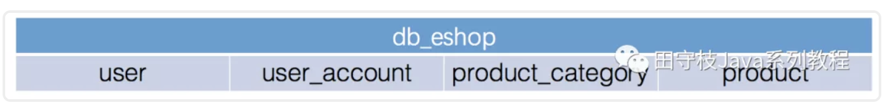
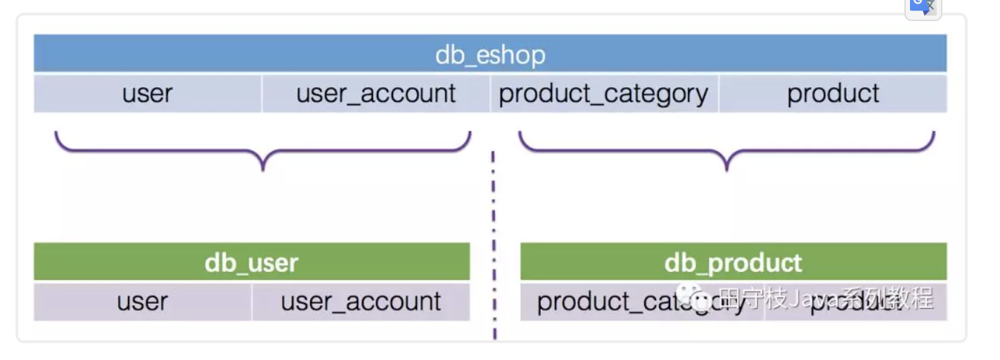
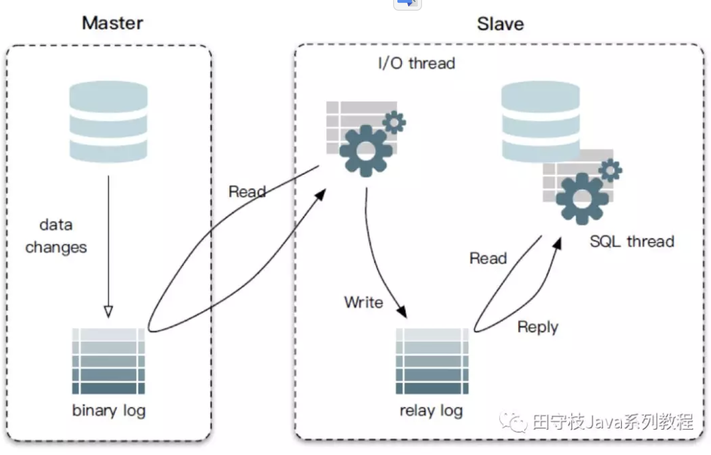

# 数据库中间件详解 | 珍藏版

## 1. 数据库拆分过程及挑战

互联网当下的数据库拆分过程基本遵循的顺序是：**垂直拆分**、**读写分离**、**分库分表(水平拆分)**。每个拆分过程都能解决业务上的一些问题，但同时也面临了一些挑战。 

### 1.1 垂直拆分

对于一个刚上线的互联网项目来说，由于前期活跃用户数量并不多，并发量也相对较小，所以此时企业一般都会选择将所有数据存放在一个数据库 中进行访问操作。举例来说，对于一个电商系统，其用户模块和产品模块的表刚开始都是位于一个库中。

其中：user、useraccount表属于用户模块，productcategory、product表属于产品模块

刚开始，可能公司的技术团队规模比较小，所有的数据都位于一个库中。随着公司业务的发展，技术团队人员也得到了扩张，划分为不同的技术小组，不同的小组负责不同的业务模块。例如A小组负责用户模块，B小组负责产品模块。此时数据库也迎来了第一次拆分：垂直拆分。

这里的垂直拆分，指的是将一个包含了很多表的数据库，根据表的功能的不同，拆分为多个小的数据库，每个库包含部分表。下图演示将上面提到的db_eshop库，拆分为db_user库和db_product库。

通常来说，垂直拆分，都是根据业务来对一个库中的表进行拆分的。关于垂直拆分，还有另一种说法，将一个包含了很多字段的大表拆分为多个小表，每个表包含部分字段，这种情况在实际开发中基本很少遇到。

垂直拆分的另一个典型应用场景是服务化(SOA)改造。在服务化的背景下，除了业务上需要进行拆分，底层的存储也需要进行隔离。 垂直拆分会使得单个用户请求的响应时间变长，原因在于，在单体应用的场景下，所有的业务都可以在一个节点内部完成，而垂直拆分之后，通常会需要进行RPC调用。然后虽然单个请求的响应时间增加了，但是整个服务的吞吐量确会大大的增加。

### 1.2 读写分离

随着业务的不断发展，用户数量和并发量不断上升。这时如果仅靠单个数据库实例来支撑所有访问压力,几乎是在 自寻死路 。以产品库为例，可能库中包含了几万种商品，并且每天新增几十种，而产品库每天的访问了可能有几亿甚至几十亿次。数据库读的压力太大，单台mysql实例扛不住，此时大部分 Mysql DBA 就会将数据库设置成 读写分离状态 。也就是一个 Master 节点(主库)对应多个 Salve 节点(从库)。可以将slave节点的数据理解为master节点数据的全量备份。

